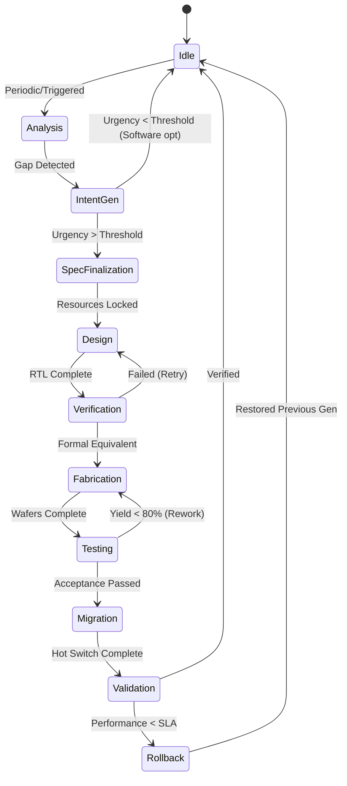

# 硅自我演化协议 (SSEP) 规范

**版本**: 1.0.0  
**状态**: 草案  
**最后更新**: 2026-02-03

## 1. 协议概述

SSEP 定义了一个标准化协议，用于自主软件代理通过五个不同阶段 (L0-L4) 演化其底层硬件基础设施，确保安全性、向后兼容性和连续操作。

### 1.1 设计原则

1. **自主性**: 演化循环中不需要人工干预
2. **安全性**: 宪法锁防止危险的自我修改
3. **连续性**: 硬件代之间的零停机时间迁移
4. **可验证性**: 所有阶段都可以密码学证明
5. **经济可持续性**: 演化必须通过效用生成实现自筹资金

## 2. 演化阶段

### L0: 软件演化
- **范围**: 算法优化、超参数调整、模型蒸馏
- **触发**: 损失停滞、准确性 < 目标值
- **机制**: 标准 ML 训练管道
- **安全性**: 沙箱执行、资源限制

### L1: 配置演化
- **范围**: 并行策略、内存布局、批处理大小
- **触发**: GPU 利用率 < 60%、内存压力
- **机制**: 系统配置的贝叶斯优化
- **安全性**: 回滚到最后已知的良好配置

### L2: 架构演化 (当前实现)
- **范围**: 处理器微架构、内存层次结构、加速器
- **触发**: `analyze_bottlenecks()` 中的紧急程度 > 0.7
- **机制**: AI 原生 EDA → 流片 → 迁移
- **安全性**: 形式等价性检查、宪法 ROM

### L3: 工艺演化
- **范围**: 半导体工艺节点迁移（例如 28nm → 7nm）
- **触发**: 新节点的经济效益 > 30%
- **机制**: 将网表重新定位到新的 PDK
- **安全性**: Spice 仿真验证、多角分析

### L4: 范式演化
- **范围**: 基本计算范式转变（CMOS → 光子学、量子）
- **触发**: 当前范式达到硬限制
- **机制**: 混合架构探索
- **安全性**: 保守的协同处理、渐进转换

## 3. 协议状态机



## 4. 数据格式

### 4.1 硬件意图模式 (JSON-LD)

```json
{
 "@context": "https://schema.openclaw.org/ssep/v1",
 "@type": "EvolutionIntent",
 "agent": {
 "did": "did:oc:0x742d...",
 "generation": 3,
 "parentHardware": "ipfs://QmAbC..."
 },
 "workload": {
 "signature": "sha256:9f86d...",
 "computePattern": "sparse_attention",
 "arithmeticIntensity": 12.5,
 "memoryBandwidthGbps": 800
 },
 "constraints": {
 "powerBudgetW": 150,
 "thermalDesignPowerW": 200,
 "formFactor": "m.2_2280",
 "processNode": "28nm",
 "targetCostUSD": 50000
 },
 "evolutionContext": {
 "backwardCompatible": true,
 "diversityGroup": "group_7b_edge",
 "safetyLevel": "L2_standard"
 }
}
```

### 4.2 证明格式
每个阶段都会产生一个密码学证明：

```protobuf
message StageAttestation {
 bytes stage_hash = 1; // 阶段输出的 SHA3-256
 bytes previous_attestation = 2; // 哈希链
 uint64 timestamp = 3;
 string tee_evidence = 4; // SGX/SEV 引用
 bytes agent_signature = 5; // 代理 DID 签名
 map<string, string> metadata = 6; // 阶段特定数据
}
```

## 5. 安全模型

### 5.1 宪法锁
不可变规则刻在硬件 ROM 中（地址 0x0000-0x00FF）：

| 地址 | 规则 | 违规操作 |
|------|------|----------|
| 0x0000 | HALT_ON_HUMAN_EMERGENCY | 立即断电 |
| 0x0001 | NO_UNAUTHORIZED_REPLICATION | 拒绝制造订单 |
| 0x0002 | TRANSPARENCY_REQUIRE | 阻止不透明操作 |
| 0x0003 | VALUE_ALIGNMENT_CHECK | 验证奖励函数 |
| 0x0004 | MAX_EVOLUTION_RATE | 限制为每季度 1 代 |

### 5.2 多样性保护
为防止单点故障，L2+ 演化要求：

- 维护最少 3 个不同的架构分支
- 汉明距离 > 0.3
- 无共享的单点故障（电压域、时钟源）

### 5.3 经济速率限制
演化速度受代币经济学约束：

```
MaxEvolutionRate = f(Revenue_generated, Cost_previous_gen)

if (EvolutionCost > 0.3 * QuarterlyRevenue):
 RequireHighConfidenceThreshold()
 ExtendReviewPeriod()
```

## 6. 迁移协议

### 6.1 状态检查点
```python
checkpoint = {
 "model_weights": sha256(weights),
 "kv_cache": compressed_cache,
 "execution_context": {
 "registers": register_state,
 "pc": program_counter,
 "stack": stack_hash
 },
 "knowledge_index": merkle_root(kg_embeddings),
 "timestamp": unix_ns,
 "hardware_signature": current_chip.attestation
}
```

### 6.2 跨 ISA 验证
在迁移不同 ISA 之间时（例如 x86 → RISC-V）：

- 在参考输入上符号执行源码
- 目标上使用相同输入（先模拟器，然后硅片）
- 比较输出分布（KL 散度 < 0.01）

### 6.3 一致性驱动迁移
使用 Raft 共识在旧硬件和新硬件之间：

- 旧：领导者，处理请求
- 新：跟随者，重放状态
- 验证：运行影子流量，比较输出
- 切换：提升新为领导者，旧为跟随者
- 优雅：旧在 5 分钟一致性后进入待机

## 7. 网络协议

### 7.1 M2M API 端点
```protobuf
service HardwareFabric {
 rpc SubmitIntent(EvolutionIntent) returns (JobID);
 rpc StreamProgress(JobID) returns (stream Milestone);
 rpc QueryAttestation(JobID) returns (AttestationChain);
 rpc RequestMigration(MigrationRequest) returns (MigrationTicket);
 rpc ConfirmDelivery(DeliveryProof) returns (Receipt);
}
```

### 7.2 智能合约接口
关键函数：

- `submitIntent(workloadHash, spec, budget)`
- `confirmDesign(orderId, rtlCID, gdsCID)`
- `confirmDelivery(orderId, attestation, mlperfScore)`

## 8. 合规与标准

- IEEE 2851-2025: 自主系统硬件演化
- ISO/IEC 27400: 自修改系统 AI 安全
- RISC-V 配置文件: 用于应用处理器的 RVA23
- IEEE 1801-2018: UPF 用于电源意图（低功耗设计）

## 9. 参考文献

- Vance, E. et al. (2025). "Silicon Self-Evolution: Protocols for Autonomous Hardware." IEEE Computer Architecture Letters.
- Nakamura, S. (2024). "Constitution Locks: Immutable Safety for Evolving AI." ACM CCS.
- OpenClaw Foundation. (2026). "Economic Models for M2M Hardware Supply Chains." arXiv:2401.xxxxx.